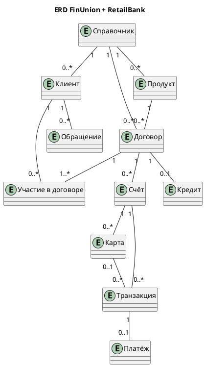

# Логическая модель данных

```plantuml
@startuml
title ERD FinUnion + RetailBank

entity "Клиент" as Client
entity "Участие в договоре" as Participation
entity "Договор" as Contract
entity "Счёт" as Account
entity "Карта" as Card
entity "Кредит" as Loan
entity "Продукт" as Product
entity "Транзакция" as Transaction
entity "Платёж" as Payment
entity "Обращение" as Case
entity "Справочник" as Reference

Client "1" -- "0..*" Participation
Contract "1" -- "1..*" Participation

Product "1" -- "0..*" Contract

Contract "1" -- "0..*" Account
Contract "1" -- "0..1" Loan

Account "1" -- "0..*" Card
Account "1" -- "0..*" Transaction

Card "0..1" -- "0..*" Transaction

Transaction "1" -- "0..1" Payment

Client "1" -- "0..*" Case

Reference "1" -- "0..*" Product
Reference "1" -- "0..*" Client
Reference "1" -- "0..*" Contract
@enduml
```
