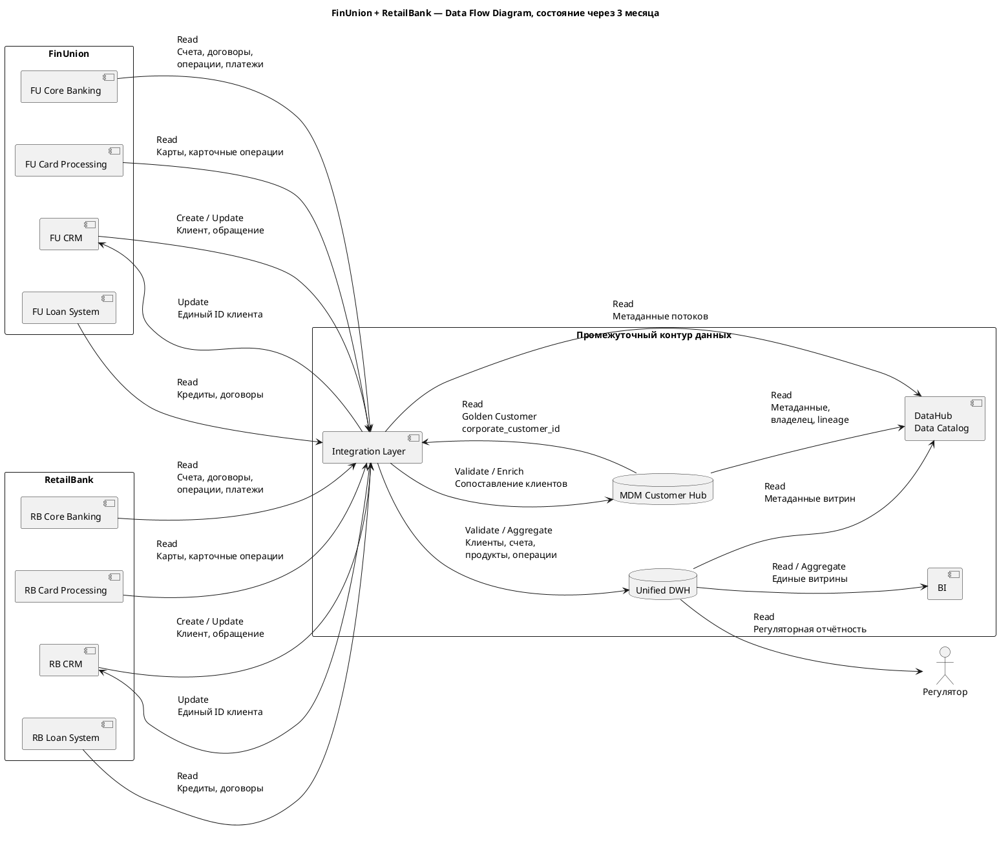

# DFD промежуточного состояния через 3 месяца

### Логика диаграммы
1. CRM двух банков продолжают создавать клиентские данные.
2. Integration Layer доставляет изменения в MDM.
3. MDM выполняет сопоставление, дедупликацию и обогащение и формирует единую запись клиента.
4. Корпоративный идентификатор возвращается в системы FinUnion и RetailBank.
5. Финансовые сущности считываются из профильных Core, Card и Loan систем.
6. Через Integration Layer данные проходят контроль и поступают в Unified DWH.
7. BI работает только с DWH, а не с операционными системами.
8. Регуляторная отчётность формируется из DWH.
9. DataHub регистрирует метаданные, владельцев и происхождение данных.

Удаление (Delete) для финансовых фактов в потоках не используется: потребители не должны удалять или исправлять мастер-записи в обход профильной системы.

| Источник | Приёмник | Сущности | Действие | Режим | Зачем |
| --- | --- | --- | --- | --- | --- |
| FU CRM | MDM | Клиент | Create / Update / Validate | Async | Создание единого профиля |
| RB CRM | MDM | Клиент | Create / Update / Validate | Async | Сопоставление клиентов RetailBank |
| MDM | FU CRM, RB CRM | Клиент | Read / Update | Async | Распространение корпоративного ID и золотой записи |
| FU Core | DWH | Счёт, договор, платёж, транзакция  | Read / Validate | CDC / batch | Единая отчётность без аналитической нагрузки на Core |
| RB Core | DWH | Счёт, договор, платёж, транзакция  | Read / Validate | CDC / batch | Включение портфеля RetailBank в общую отчётность |
| FU Cards | DWH | Карта, транзакция | Read / Validate | CDC / batch | Карточная аналитика |
| RB Cards | DWH | Карта, транзакция | Read / Validate | CDC / batch | Объединение карточных данных |
| FU Loans | DWH | Кредит, договор | Read / Validate | Batch | Общий кредитный портфель |
| RB Loans | DWH | Кредит, договор | Read / Validate | Batch | Общий кредитный портфель |
| MDM | DWH | Клиент, продукт, справочник | Read / Enrich | Batch / CDC | Использование согласованных измерений |
| DWH | BI | Клиенты, счета, продукты, операции | Aggregate / Read | Batch | Единые управленческие витрины |
| DWH | Регулятор | Регламентированные данные | Aggregate / Read | Batch | Регуляторная отчётность |
| MDM / Integration / DWH | DataHub | Метаданные | Create / Update | Async / batch | Lineage, каталог, владельцы |

CDC используется там, где требуется передавать изменения из транзакционных БД без выполнения тяжёлой аналитики непосредственно на них. Batch подходит для периодической отчётности и массивных загрузок.

### Код диаграммы

