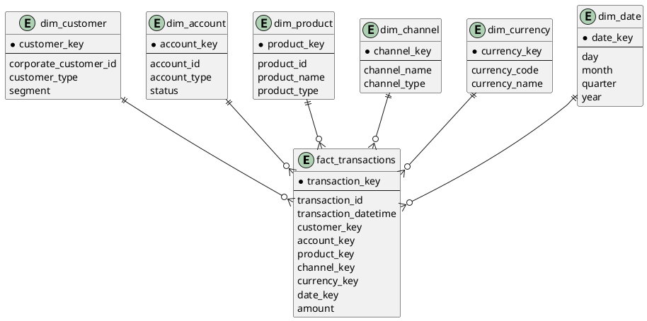

# Аналитическая модель

Выбирается схема **'Звезда'**.

### Гранулярность

Одна запись fact_transactions = одна финансовая транзакция

| Тип | Таблица | Основные данные |
| --- | --- | --- |
| Fact | fact_transactions | transaction_id, amount, transaction_datetime, customer_key, account_key, product_key, channel_key, currency_key, date_key |
| Dimension | dim_customer | corporate_customer_id, segment, customer_type |
| Dimension | dim_account | account_id, account_type, status |
| Dimension | dim_product | product_id, product_name, product_type |
| Dimension | dim_channel | channel_name, channel_type |
| Dimension | dim_currency | currency_code, currency_name |
| Dimension | dim_date | day, month, quarter, year |

### Схема

### Почему подходит для OLAP-нагрузки

Для BI требуется анализировать транзакции:
- по клиенту и сегменту
- по счёту
- по продукту
- по каналу
- по валюте
- по периоду

'Звезда' уменьшает количество связей в пользовательских запросах и делает модель понятнее для BI. Она проще для потребителей и снижает вероятность ошибок при построении отчётов.
