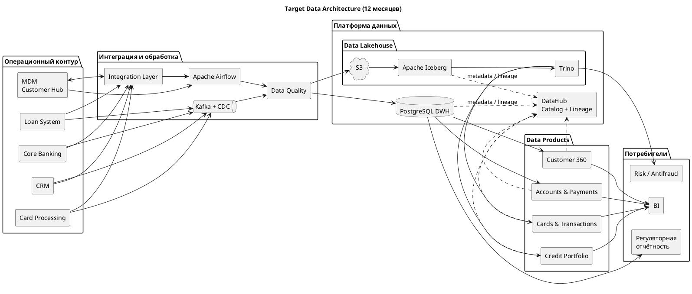

# Целевая архитектура данных

### Архитектурный подход

В качестве целевой выбрана гибридная архитектура:
- Operational Systems: выполнение банковских операций и хранение актуального операционного состояния
- MDM: золотая запись клиента, единые идентификаторы и справочники
- Integration Layer: синхронные и асинхронные интеграции
- Kafka + CDC: доставка событий и изменений
- PostgreSQL DWH: согласованные структурированные данные, регламентированная и управленческая отчётность
- S3 + Apache Iceberg: Data Lakehouse для большой истории и событий
- Trino: SQL доступ к Lakehouse
- Airflow: оркестрация batch ETL/ELT
- BI: отчёты, дашборды и аналитика
- DataHub: каталог, владельцы, метаданные и lineage
- Data Products: публикация согласованных данных по бизнес доменам

Такое разделение соответствует принципу: операционный контур оптимизирован для проведения операций, а аналитический — для массового чтения, агрегаций и исторического анализа.

### Диаграмма To-Be

